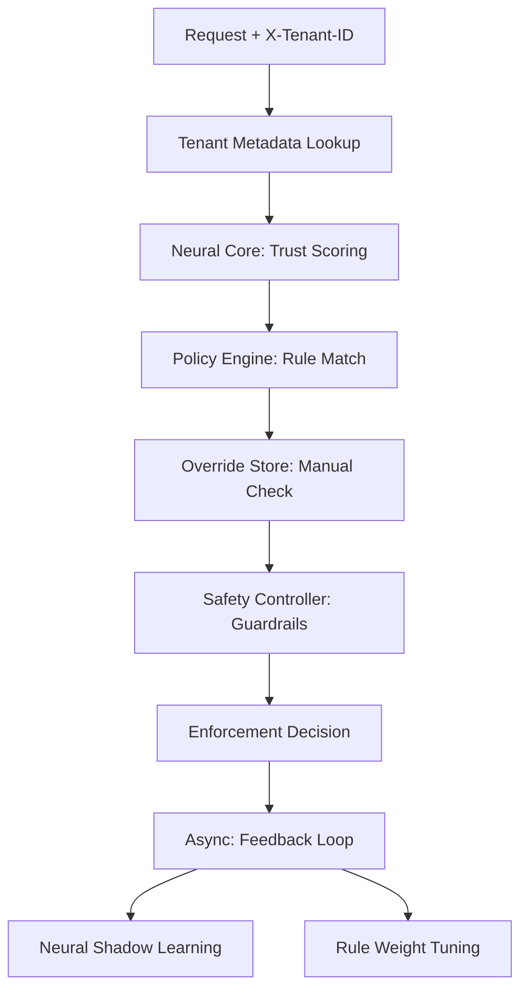

# Argent Sentinel — Session Technical History
**Session ID:** `e16dba89-4edc-4b55-b4bb-9f807b27a387`
**Duration:** April 20, 2026

## 🎯 Central Objective
Evolve Argent Sentinel into a production-hardened, multi-tenant Zero Trust Control Plane. The focus is on **"Control before Capability"** — ensuring logic, safety, and isolation are robust before scaling the neural intelligence.

---

## 🛠️ Chronological Execution Log

### 1. Initialization & Core Policy Engine (Phase A)
*   **Request:** Implement a declarative YAML-based policy system to make the system governable.
*   **Actions:**
    *   Created `policies/rules.yaml` with 14 foundational rules (GEO-isolation, MFA triggers, credential exfiltration blocks).
    *   Developed `policy_engine.py`: A high-performance rule evaluator supporting most-severe conflict resolution and hot-reloading.
    *   Developed `policy_overrides.py`: A persistent SQLite store for manual `FORCE_ALLOW` / `FORCE_ISOLATE` actions with TTL.
    *   Integrated `LiveEnforcementEngine` into `app.py`'s authorization flow.
*   **Outcome:** System now evaluates rules *after* neural trust scoring, allowing declarative overrides of model behavior.

### 2. Multi-Tenant Isolation (Phase B)
*   **Request:** Add a multi-tenant layer to partition logic and configuration.
*   **Actions:**
    *   Created `tenants/tenants.yaml` with dedicated configurations for `fintech-prod` (stricter) and `research-sandbox` (relaxed).
    *   Developed `tenant_registry.py`: Registry for tenant-specific thresholds and rate limits.
    *   Implemented `tenant_isolation_middleware`: Extracts `X-Tenant-ID` and scopes all request state.
    *   Migrated DB schema to include `tenant_id` across `entities`, `telemetry`, and `enforcement_log`.
*   **Outcome:** Full SaaS-ready isolation. Requests are now evaluated against tenant-specific trust thresholds.

### 3. Safety Guardrails & Circuit Breakers (Phase C)
*   **Request:** Implement execution limits to prevent catastrophic automated actions.
*   **Actions:**
    *   Developed `safety_controller.py`:
        *   **ExecutionLimits**: Sliding-window caps for Isolations, Mutations, and Risk Budgets.
        *   **CircuitBreaker**: Automatic "Open" state if Isolation rates exceed 40% in 60 seconds.
    *   Wired `SafetyController` into the final stage of `authorize_logic`.
    *   Exposed `/safety/status` and `/safety/circuit/reset` endpoints.
*   **Outcome:** Failure protection. System will now downgrade `ISOLATE` to `RATE_LIMIT` if caps are exceeded, and "fail closed" to `RATE_LIMIT` if anomalous spikes occur.

### 4. Intelligence & Feedback Loop (Phase D)
*   **Request:** Introduce context awareness and ground-truth feedback.
*   **Actions:**
    *   Developed `intelligence_layer.py`:
        *   **Context Score**: Enriches requests with entity criticality, time-of-day risk, and velocity.
        *   **Feedback & Adjuster**: Tracks ground-truth labels and suggests rule weight shifts if FP/FN rates are high.
        *   **Model Feedback**: Routes incorrect decisions back to the TabNet shadow learning hard-buffer.
    *   Wired `/gateway/feedback` to trigger the Intelligence Layer.
    *   Exposed `/intelligence/suggestions` and `/intelligence/status`.
*   **Outcome:** The system now learns from its environment. Failed detections are automatically queued as priority training samples for the neural core.

---

## 🏛️ System Architecture Snapshot

## 📊 Key Milestone Metrics (Verified)
- **Rules Integrated:** 14 active policies.
- **Tenant Isolation:** Verified `fintech-prod` vs `default` threshold separation.
- **Circuit Breaker:** Verified automatic trip on 90% anomaly spike.
- **Safety Downscaling:** Verified 51st isolation downgrade within 60s window.

---

## 📅 Remaining Roadmap
- **Phase E**: Visibility (SOC Dashboards + Alerting).
- **Phase F**: Infrastructure (Migration to PostgreSQL/Redis).
- **Phase G**: Threat Intel Integration.
